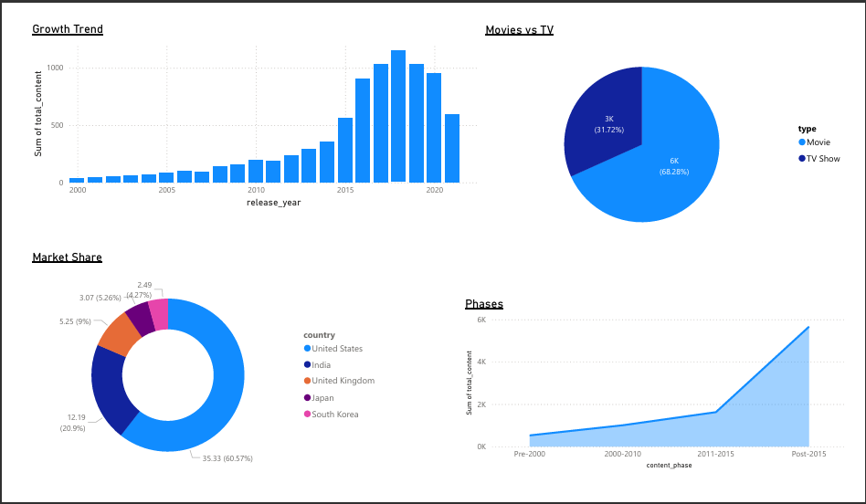

# Netflix Content Strategy Analysis

## Project Overview
This project analyzes the Netflix dataset (8,800+ titles) to understand content trends, global market share, and the platform's shift towards digital streaming.

## Data Source
* **Source:** Kaggle (Netflix Movies and TV Shows Dataset)
* **Description:** A dataset containing details of all movies and TV shows released on Netflix, including cast, country, release year, and rating.

## Tech Stack
* **SQL (PostgreSQL):** Data cleaning, window functions, and aggregation.
* **Power BI:** Dashboarding and data visualization.

## Key Findings
1.  **Growth Trend:** Content production exploded significantly after 2015, marking the peak of the streaming revolution.
2.  **Movies vs TV:** Movies constitute **68%** of the platform's library vs. TV Shows (32%), indicating a film-first strategy.
3.  **Market Share:** The USA leads content production, followed by India and the UK.
4.  **Strategic Phases:** The "Streaming Era" (Post-2015) represents the platform's most aggressive growth phase, significantly outpacing the legacy library.

## Visuals

